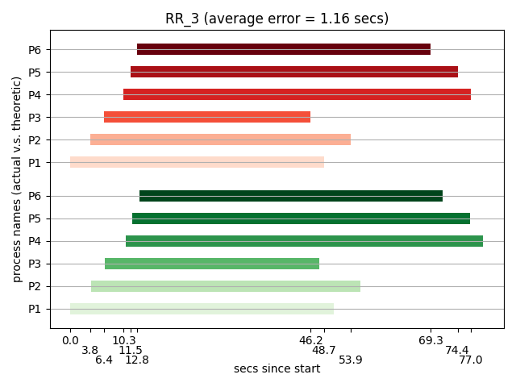

# 2020 OS Project 1 - Process Scheduling
### By: B06902097  資工三 楊皓丞
## 設計
### 執行方式
在有 sudo 權限下，執行
```
make
./scheduler < OS_PJ1_Test/{test}.txt > output/{test}_stdout.txt
dmesg --clear
dmesg -t | grep Project1 > output/{test}_dmesg.txt
```
### 核心概念
本次 scheduler 的設計中，其實 4 種 schedule 方式我的 code 是很相近的，都是遵照著以下說明的設計模式。我使用一個`waiting_queue`和一個`ready_queue`來分別維護還沒以及已經到 ready_time 的 process ，這兩個 queue 中對於每個 process 分別維護 `(id, ready_time, execution_time)`及`(id, ready_time, execution_time, last_enter_time)`，其中`last_enter`為 process 上次進到 ready_queue 的時間。這兩個 queue 依據不同的 schedule policy ，會有不同的排序依據，定義`waiting_keys`及`ready_keys`代表兩個 queue 排序時依序使用維護資料的哪些欄位。

`./scheduler`的運作方式為，先依據`waiting_keys`將`waiting_queue`排序，之後模擬時間單位的進行，並在每個時間點`t`時依序：
1. 將`waiting_queue`中 ready_time 為`t`的 processes 依序搬到`ready_queue`中，此時若是 PSJF ，要判斷有沒有 preemption 發生，有的話要將現在運行中的 process 暫停並重新放回 `ready_queue`
2. 若現在有 process 運行中，且`t`等於該 process 的執行結束時間，那麼我們用`waitpid`確定該 process 已成功結束（若還沒的話，也可達到同步效果，避免他跟後面 process 執行時間交錯）。不過若是 RR ，設定的此 process 執行結束時間可能只是本次 time quantum 的結尾，並不代表此 process 真正結束，此時我們改將現在運行中的 process 暫停。暫停 process 的方式為使用`sched_setscheduler`設定低的 priority 。
3. 若現在沒有 process 進行中，且`ready_queue`中有 process ，則將`ready_queue`按照`ready_keys`排序，並將第一個 process 取出成為現在進行中的 process 。若此 process 這是第一次拿到 CPU ，則要 fork 出一個`./process`來執行此 process 。
4. 若現在有 process 進行中，將他的 priority 設為高，以確保他盡可能的使用 CPU time。

`./process`的運作方式為：
1. `execution_time`會作為參數來執行
2. 開始時用`clock_gettime`紀錄開始時間
3. 跑`execution_time`次`unit_time`的迴圈
4. 跑完後用`clock_gettime`紀錄結束時間
5. 印出結果至`dmesg`

為了避免`./scheduler`跟`./process`搶資源，分別用`sched_setaffinity`設定跑在兩顆 CPU 上。

### 虛擬碼
```
waiting_keys: depends on policy
ready_keys: depends on policy
sort(waiting_queue, waiting_keys)
t = 0
while True:
    while ready_time of waiting_queue.front == t:
        ready_queue.push(waiting_queue.front)
        if policy == 'PSJF' and waiting_queue.front is better:
            # preempt
            ready_queue.push(current_process)
            set_priority(cur_process, LOW)
            cur_process = None
        waiting_queue.pop()
    
    if t == cur_process's finish time:
        if policy == 'RR' and t != cur_process's true finish time:
            set_priority(cur_process, LOW)
        else:
            wait(cur_process)
        cur_process = None
        if waiting_queue and ready_queue are empty:
            break
    
    if no cur_process and ready_queue not empty:
        sort(ready_queue, ready_keys)
        cur_process = ready_queue.front
        ready_queue.pop
        if policy == 'RR' and time_quantum < exec_time:
            ready_queue.push(cur_process with exec_time -= time_quantum)
            cur_process's finish time = t + time_quantum
        else:
            cur_process's finish time = t + exec_time
        if first time running cur_process:
            create_process(true exec_time)
            record pid
    
    if cur_process:
        set_priority(cur_process, HIGH)
    
    unit_time()
    
```
### 不同排程法實作差異
除了上述已說明的些微差異（如 PSJF 要做 preemption，RR 一次放進去跑只能跑`time_quantum`個時間單位），剩餘的差別主要是在`waiting_keys`和`ready_keys`的設定，不同的 process 排序方法決定了不同的 schedule policy。
- `waiting_queue`中 process 的內容紀錄`(id, ready_time, execution_time)`
- `ready_queue`中 process 的內容紀錄`(id, ready_time, execution_time, last_enter)`
- FIFO： `waiting_keys = (1, 0), ready_keys = (1, 0)`，意即主要用`ready_time`做排序，`id`當 tiebreaker，即可模擬 FIFO。
- RR: `waiting_keys = (1, 0), ready_keys = (3, 1, 0)`，意即從`ready_queue`中選取 process 前，要優先選最久以前放進 queue 的，剩下的當 tiebreaker，達成 RR 中輪流執行的效果。
- SJF: `waiting_keys = (1, 0), ready_keys = (2,  1, 0)`，意即優先選較短的 process 執行，即為 SJF。
- PSJF: `waiting_keys = (1, 0), ready_keys = (2,  3, 1, 0)`，意即優先選較短的 process 執行，PSJF 和 SJF 的實作差異主要不在這邊，在前面就已說明的 preemption。不過由於 PSJF 中 process 有可能被不斷地放回 queue，因此同長度的 process 中我選擇先用`last_enter`時間當作 tiebreaker，比較公平的感覺。不過測資中沒有這種 case，實際上這種狀況讓誰先跑應該也沒什麼差。

## 核心版本
核心版本為`5.6.5-arch3-1`，執行環境為我筆電上 VirtualBox 內的 arch-linux 虛擬機。

## 實際結果與理論結果比較
### TIME_MEASUREMENT
資料內容
```
FIFO
10
P0 0 500
P1 1000 500
P2 2000 500
P3 3000 500
P4 4000 500
P5 5000 500
P6 6000 500
P7 7000 500
P8 8000 500
P9 9000 500
```
執行結果
```
P0 1251
P1 1253
P2 1254
P3 1255
P4 1256
P5 1257
P6 1258
P7 1259
P8 1260
P9 1261
[Project1] 1251 1587651036.775662653 1587651038.024069797
[Project1] 1253 1587651039.380886903 1587651040.654909557
[Project1] 1254 1587651041.935711025 1587651043.201340539
[Project1] 1255 1587651044.637562974 1587651045.917845227
[Project1] 1256 1587651047.227634255 1587651048.523973712
[Project1] 1257 1587651049.872501175 1587651051.170545795
[Project1] 1258 1587651052.500224419 1587651053.829878462
[Project1] 1259 1587651055.195169890 1587651056.471851774
[Project1] 1260 1587651057.829041546 1587651059.140551732
[Project1] 1261 1587651060.440727017 1587651061.686054869
```
以平均執行時間除以 500 來估計 time unit，得到我的執行環境中 time unit 約為 0.00256518 秒。以下的理論值皆以此 time unit 數值計算。
### FIFO
#### 1
資料內容
```
FIFO
5
P1 0 500
P2 0 500
P3 0 500
P4 0 500
P5 0 500
```
執行結果
```
P1 968
P2 969
P3 971
P4 972
P5 973
[Project1] 968 1587648967.673254898 1587648968.964165552
[Project1] 969 1587648968.971466860 1587648970.320442292
[Project1] 971 1587648970.355580359 1587648971.662060320
[Project1] 972 1587648971.700069226 1587648972.968883854
[Project1] 973 1587648973.005636204 1587648974.351542899
```
與理論值的比較圖（下方為實際執行結果，上方為理論結果，後面的圖皆同）：

#### 2
資料內容
```
FIFO
4
P1 0 80000
P2 100 5000
P3 200 1000
P4 300 1000
```
執行結果
```
P1 982
P2 984
P3 985
P4 986
[Project1] 982 1587648984.472934196 1587649194.522631917
[Project1] 984 1587649195.846393998 1587649208.800997514
[Project1] 985 1587649208.986270330 1587649211.535571564
[Project1] 986 1587649211.593817834 1587649214.137171027
```
與理論值的比較圖：

#### 3
資料內容
```
FIFO
7
P1 0 8000
P2 200 5000
P3 300 3000
P4 400 1000
P5 500 1000
P6 500 1000
P7 600 4000
```
執行結果
```
P1 995
P2 996
P3 997
P4 998
P5 1000
P6 1001
P7 1002
[Project1] 995 1587649224.232694490 1587649245.379377400
[Project1] 996 1587649245.380369019 1587649258.472968225
[Project1] 997 1587649258.599374388 1587649266.336513994
[Project1] 998 1587649266.503473923 1587649269.052943848
[Project1] 1000 1587649269.168875433 1587649271.733705244
[Project1] 1001 1587649271.778121973 1587649274.383987769
[Project1] 1002 1587649274.408628577 1587649285.003764755
```
與理論值的比較圖：

#### 4
資料內容
```
FIFO
4
P1 0 2000
P2 500 500
P3 500 200
P4 1500 500
```
執行結果
```
P1 1011
P2 1012
P3 1013
P4 1014
[Project1] 1011 1587649295.032243202 1587649300.217421239
[Project1] 1012 1587649300.218426914 1587649301.506542182
[Project1] 1013 1587649301.507709020 1587649302.028076463
[Project1] 1014 1587649302.029135308 1587649303.310815748
```
與理論值的比較圖：

#### 5
資料內容
```
FIFO
7
P1 0 8000
P2 200 5000
P3 200 3000
P4 400 1000
P5 400 1000
P6 600 1000
P7 600 4000
```
執行結果
```
P1 1023
P2 1025
P3 1026
P4 1027
P5 1028
P6 1029
P7 1030
[Project1] 1023 1587649313.375065814 1587649334.165066306
[Project1] 1025 1587649334.581690201 1587649347.700970778
[Project1] 1026 1587649347.847418723 1587649355.694159204
[Project1] 1027 1587649355.748614758 1587649358.356850870
[Project1] 1028 1587649358.357996336 1587649361.006402706
[Project1] 1029 1587649361.007414035 1587649363.627693205
[Project1] 1030 1587649363.628769488 1587649374.177462729
```
與理論值的比較圖：

### RR
#### 1
資料內容
```
RR
5
P1 0 500
P2 0 500
P3 0 500
P4 0 500
P5 0 500
```
執行結果
```
P1 1039
P2 1040
P3 1041
P4 1043
P5 1044
[Project1] 1039 1587649384.225315616 1587649385.494158860
[Project1] 1040 1587649385.494938052 1587649386.759577634
[Project1] 1041 1587649386.792709126 1587649388.129571397
[Project1] 1043 1587649388.131391778 1587649389.425906200
[Project1] 1044 1587649389.426662200 1587649390.691684912
```
與理論值的比較圖：

#### 2
資料內容
```
RR
2
P1 600 4000
P2 800 5000
```
執行結果
```
P1 1053
P2 1054
[Project1] 1053 1587649402.291269468 1587649421.860080927
[Project1] 1054 1587649403.580761345 1587649425.655258315
```
與理論值的比較圖：

#### 3
資料內容
```
RR
6
P1 1200 5000
P2 2400 4000
P3 3600 3000
P4 4800 7000
P5 5200 6000
P6 5800 5000
```
執行結果
```
P1 1063
P2 1064
P3 1065
P4 1066
P5 1067
P6 1068
[Project1] 1065 1587649445.655513120 1587649486.904973220
[Project1] 1063 1587649439.035297718 1587649489.587272915
[Project1] 1064 1587649442.988256167 1587649494.806980434
[Project1] 1068 1587649452.294240809 1587649510.621085465
[Project1] 1067 1587649450.971933053 1587649515.771740451
[Project1] 1066 1587649449.673279240 1587649518.346060762
```
與理論值的比較圖：

#### 4
資料內容
```
RR
7
P1 0 8000
P2 200 5000
P3 300 3000
P4 400 1000
P5 500 1000
P6 500 1000
P7 600 4000
```
執行結果
```
P1 1077
P2 1078
P3 1079
P4 1080
P5 1081
P6 1082
P7 1083
[Project1] 1080 1587649532.918110727 1587649543.545436773
[Project1] 1081 1587649534.262073622 1587649544.822957424
[Project1] 1082 1587649535.567652897 1587649546.151530174
[Project1] 1079 1587649531.591692410 1587649567.264683368
[Project1] 1083 1587649536.889221655 1587649576.726066413
[Project1] 1078 1587649530.253614475 1587649581.745335447
[Project1] 1077 1587649528.962499397 1587649589.491362093
```
與理論值的比較圖：

#### 5
資料內容
```
RR
7
P1 0 8000
P2 200 5000
P3 200 3000
P4 400 1000
P5 400 1000
P6 600 1000
P7 600 4000
```
執行結果
```
P1 1093
P2 1094
P3 1095
P4 1096
P5 1097
P6 1098
P7 1099
[Project1] 1096 1587649604.014175647 1587649614.644169940
[Project1] 1097 1587649605.381827424 1587649615.954472131
[Project1] 1098 1587649606.667539267 1587649617.220544754
[Project1] 1095 1587649602.704298272 1587649638.295968352
[Project1] 1099 1587649607.983457910 1587649647.702581118
[Project1] 1094 1587649601.425754932 1587649652.786085056
[Project1] 1093 1587649600.149516131 1587649660.647392894
```
與理論值的比較圖：

### SJF
#### 1
資料內容
```
SJF
4
P1 0 7000
P2 0 2000
P3 100 1000
P4 200 4000
```
執行結果
```
P1 1112
P2 1108
P3 1109
P4 1110
[Project1] 1108 1587649671.198467366 1587649676.376955768
[Project1] 1109 1587649676.470183035 1587649679.038090829
[Project1] 1110 1587649679.073158104 1587649689.619968104
[Project1] 1112 1587649689.669281585 1587649708.213781225
```
與理論值的比較圖：

#### 2
資料內容
```
SJF
5
P1 100 100
P2 100 4000
P3 200 200
P4 200 4000
P5 200 7000
```
執行結果
```
P1 1122
P2 1124
P3 1123
P4 1125
P5 1126
[Project1] 1122 1587649718.571559216 1587649718.794895006
[Project1] 1123 1587649718.843955384 1587649719.343813167
[Project1] 1124 1587649719.373250558 1587649729.979891857
[Project1] 1125 1587649730.013834471 1587649740.636157490
[Project1] 1126 1587649740.637190751 1587649759.034237178
```
與理論值的比較圖：

#### 3
資料內容
```
SJF
8
P1 100 3000
P2 100 5000
P3 100 7000
P4 200 10
P5 200 10
P6 300 4000
P7 400 4000
P8 500 9000
```
執行結果
```
P1 1135
P2 1140
P3 1141
P4 1136
P5 1137
P6 1138
P7 1139
P8 1142
[Project1] 1135 1587649769.593685701 1587649777.416249685
[Project1] 1136 1587649777.569243874 1587649777.588983748
[Project1] 1137 1587649777.589720508 1587649777.609194105
[Project1] 1138 1587649777.610293069 1587649788.170088784
[Project1] 1139 1587649788.295639951 1587649798.669930020
[Project1] 1140 1587649798.912483467 1587649812.111141510
[Project1] 1141 1587649812.227610007 1587649830.698742716
[Project1] 1142 1587649830.887706100 1587649854.678580434
```
與理論值的比較圖：

#### 4
資料內容
```
SJF
5
P1 0 3000
P2 1000 1000
P3 2000 4000
P4 5000 2000
P5 7000 1000
```
執行結果
```
P1 1151
P2 1152
P3 1153
P4 1156
P5 1155
[Project1] 1151 1587649864.961174903 1587649872.847013941
[Project1] 1152 1587649872.847848370 1587649875.522979163
[Project1] 1153 1587649875.544875694 1587649886.033638577
[Project1] 1155 1587649886.349665540 1587649888.928092411
[Project1] 1156 1587649888.948139121 1587649894.149035903
```
與理論值的比較圖：

#### 5
資料內容
```
SJF
4
P1 0 2000
P2 500 500
P3 1000 500
P4 1500 500
```
執行結果
```
P1 1165
P2 1166
P3 1167
P4 1168
[Project1] 1165 1587649904.271096215 1587649909.418260915
[Project1] 1166 1587649909.517644358 1587649910.782883042
[Project1] 1167 1587649910.828158645 1587649912.141997212
[Project1] 1168 1587649912.161307961 1587649913.470134566
```
與理論值的比較圖：

### PSJF
#### 1
資料內容
```
PSJF
4
P1 0 10000
P2 1000 7000
P3 2000 5000
P4 3000 3000
```
執行結果
```
P1 1177
P2 1178
P3 1179
P4 1180
[Project1] 1180 1587649931.435839701 1587649939.298432439
[Project1] 1179 1587649928.777413185 1587649949.900829968
[Project1] 1178 1587649926.140577485 1587649965.577004595
[Project1] 1177 1587649923.515573531 1587649989.201530870
```
與理論值的比較圖：

#### 2
資料內容
```
PSJF
5
P1 0 3000
P2 1000 1000
P3 2000 4000
P4 5000 2000
P5 7000 1000
```
執行結果
```
P1 1189
P2 1190
P3 1191
P4 1192
P5 1193
[Project1] 1190 1587650002.798406087 1587650005.465862895
[Project1] 1189 1587650000.133506494 1587650010.713442342
[Project1] 1192 1587650013.430939630 1587650018.695414877
[Project1] 1193 1587650018.728812111 1587650021.376149595
[Project1] 1191 1587650010.792912573 1587650029.142937531
```
與理論值的比較圖：

#### 3
資料內容
```
PSJF
4
P1 0 2000
P2 500 500
P3 1000 500
P4 1500 500
```
執行結果
```
P1 1202
P2 1203
P3 1204
P4 1205
[Project1] 1203 1587650040.687399713 1587650042.016406822
[Project1] 1204 1587650042.017145207 1587650043.342453645
[Project1] 1205 1587650043.343277134 1587650044.664817795
[Project1] 1202 1587650039.393664586 1587650048.660353013
```
與理論值的比較圖：

#### 4
資料內容
```
PSJF
4
P1 0 7000
P2 0 2000
P3 100 1000
P4 200 4000
```
執行結果
```
P1 1218
P2 1214
P3 1215
P4 1217
[Project1] 1215 1587650058.954947795 1587650061.724189672
[Project1] 1214 1587650058.717179085 1587650066.784745596
[Project1] 1217 1587650066.836615714 1587650077.481629083
[Project1] 1218 1587650077.619231318 1587650096.469762682
```
與理論值的比較圖：

#### 5
資料內容
```
PSJF
5
P1 100 100
P2 100 4000
P3 200 200
P4 200 4000
P5 200 7000
```
執行結果
```
P1 1227
P2 1229
P3 1228
P4 1230
P5 1231
[Project1] 1227 1587650106.800970437 1587650107.056844623
[Project1] 1228 1587650107.074159700 1587650107.565051696
[Project1] 1229 1587650107.592537516 1587650118.135835945
[Project1] 1230 1587650118.164488864 1587650128.936199757
[Project1] 1231 1587650129.055686119 1587650148.201356024
```
與理論值的比較圖：


### 造成差異的原因
1. 理論值中假設 scheduler 可以不耗時間的決定 process 間誰先誰後，誰什麼時候該暫停。但實際上在每個時間點中 scheduler 都需要去做一些工作，像是資料結構的操作、排序，以及一些判斷，這些工作都是需要時間的。而且隨著時間越久，這些誤差累積起來就越來越大，且可以發現圖中有 error 時，通常都是實際結束時間晚於理論時間，這可能就是因為 scheduler 的 overhead。
2. time_unit 是定義成迴圈執行時間，但是其實每次執行時間都有些微差距，scheduler 和 process 跑的時間可能也不盡一樣，造成排程狀況遠離理想值（同個時間長度，可能 process 早就跑完了，scheduler 那邊還沒跑完，或是相反）。
3. 第三個問題是硬體問題，實際上在我的電腦跑虛擬機會造成不小的負擔，我已經選用無 GUI 模式的虛擬機了，但在跑比較長的那幾個測資時，風扇都轉蠻大聲的，此狀況代表 CPU 可能沒辦法用跑小測資的同樣效能去跑大測資，造成大測資誤差較大。